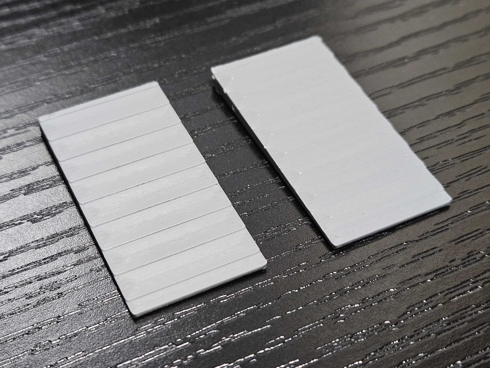

# BambuStudio-ZAA

This is a fork of Bambu Studio that implements a non-planar slicing feature called Z anti-aliasing or contouring. The basic idea is to dynamically vary the height of extrusions within a single layer to reduce stair-stepping artifacts on top surfaces.

When starting the application, Z contouring can be controlled under the "Z Contouring" section in Global or Objects settings, under the Quality tab.

## Common Problems

If you are seeing poor quality extrusion, you may be printing too fast. Slow down outer and inner wall and top surface speed to 20 mm/s.

If you are seeing stringing, it may be due to collisions. If you try to extrude a line segment at high z and then try to extrude another line next to it at a low Z, the nozzle will collide with the previous extrusion, damaging it. Try reducing the number of wall loops to 1 or use outer/inner order of walls. The concentric top surface pattern can also cause this depending on the direction.

## Prior Work

This work is based on

- [[1609.03032] Anti-aliasing for fused filament deposition](https://arxiv.org/abs/1609.03032) by Hai-Chuan Song et al.

- [Theaninova/GCodeZAA](https://github.com/Theaninova/GCodeZAA) - GCode post-processing script to enable smooth(-ish) non-planar top surfaces

## Limitations

Collisions are currently not handled though a method of doing is described in the paper.

The algorithm performs a large number of ray intersection tests and this is done using a general purpose ray intersection algorithm. This can likely be sped up using a purpose-specific structure since the direction vector is always fixed.

## Original README

Bambu Studio is a cutting-edge, feature-rich slicing software.  
It contains project-based workflows, systematically optimized slicing algorithms, and an easy-to-use graphic interface, bringing users an incredibly smooth printing experience.

Prebuilt Windows, macOS 64-bit and Linux releases are available through the [github releases page](https://github.com/bambulab/BambuStudio/releases/).

Bambu Studio is based on [PrusaSlicer](https://github.com/prusa3d/PrusaSlicer) by Prusa Research, which is from [Slic3r](https://github.com/Slic3r/Slic3r) by Alessandro Ranellucci and the RepRap community.

See the [wiki](https://github.com/bambulab/BambuStudio/wiki) and the [documentation directory](https://github.com/bambulab/BambuStudio/tree/master/doc) for more information.

# What are Bambu Studio's main features?

Key features are:

- Basic slicing features & GCode viewer
- Multiple plates management
- Remote control & monitoring
- Auto-arrange objects
- Auto-orient objects
- Hybrid/Tree/Normal support types, Customized support
- multi-material printing and rich painting tools
- multi-platform (Win/Mac/Linux) support
- Global/Object/Part level slicing parameters

Other major features are:

- Advanced cooling logic controlling fan speed and dynamic print speed
- Auto brim according to mechanical analysis
- Support arc path(G2/G3)
- Support STEP format
- Assembly & explosion view
- Flushing transition-filament into infill/object during filament change

# How to compile

Following platforms are currently supported to compile:

- Windows 64-bit, [Compile Guide](https://github.com/bambulab/BambuStudio/wiki/Windows-Compile-Guide)
- Mac 64-bit, [Compile Guide](https://github.com/bambulab/BambuStudio/wiki/Mac-Compile-Guide)
- Linux, [Compile Guide](https://github.com/bambulab/BambuStudio/wiki/Linux-Compile-Guide)
  - currently we only provide linux appimages on [github releases](https://github.com/bambulab/BambuStudio/releases) for Ubuntu/Fedora, and a [flathub version](https://flathub.org/apps/com.bambulab.BambuStudio) can be used for all the linux platforms

# Report issue

You can add an issue to the [github tracker](https://github.com/bambulab/BambuStudio/issues) if **it isn't already present.**

# License

Bambu Studio is licensed under the GNU Affero General Public License, version 3. Bambu Studio is based on PrusaSlicer by PrusaResearch.

PrusaSlicer is licensed under the GNU Affero General Public License, version 3. PrusaSlicer is owned by Prusa Research. PrusaSlicer is originally based on Slic3r by Alessandro Ranellucci.

Slic3r is licensed under the GNU Affero General Public License, version 3. Slic3r was created by Alessandro Ranellucci with the help of many other contributors.

The GNU Affero General Public License, version 3 ensures that if you use any part of this software in any way (even behind a web server), your software must be released under the same license.

The bambu networking plugin is based on non-free libraries. It is optional to the Bambu Studio and provides extended networking functionalities for users.
By default, after installing Bambu Studio without the networking plugin, you can initiate printing through the SD card after slicing is completed.
